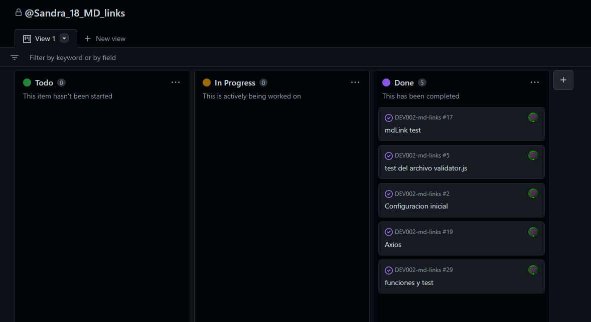
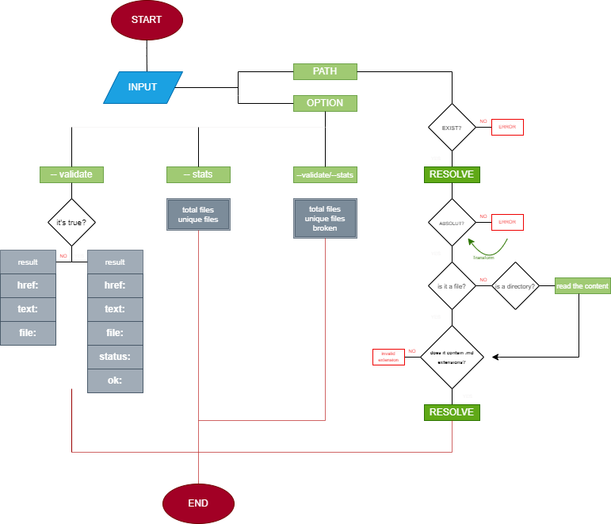

# Markdown Links

## Índice

* [1. Preámbulo](#1-preámbulo)
* [2. Instalación](#2-instalacion)
* [3. Uso](#3-Uso)
* [4. Consideraciones](#4-Consideraciones-Generales)


***

## 1. Preámbulo

[Markdown](https://es.wikipedia.org/wiki/Markdown)


## mdLinks es una herramienta de node js que nos ayuda a validar archivos `markdown`, permitiendonos saber:

1. cantidad de links
2. links roto
3. links unicos.

## 2. Instalacion

- para instalar esta herramienta te sugerimos continuar los siguientes pasos:

1. instalar mdLinks de forma global

````
npm install -g  validate-link-ss
````

2. También puede instalar mdLinks como una dependencia de desarrollo:

````
npm install validate-link-ss --save-dev
````

3. puede usar github para su instalación

````
npm install https://github.com/SandraLore18/DEV002-md-links.git
````
## 3. Uso

- una vez instalada la herramienta a su proyecto , continúa los siguientes pasos:

1. si se instala de forma global solo es llamar la herramienta y pasar el archivo `markdown`

````
validate-link-ss <path-name-file.md>
````

2. si lo instaló como una dependecia de desarrollo utilice el siguiente comando:

````
npx validate-link-ss <path-name-file.md>
````

- obtendrá información de todos los links encontrados en su archivo `.md`

````js
[
  {
    file: "name of your file",
    link: "name of the link",
    text: "content of the link"
  },
  {
    file: "name of your file",
    link: "name of the link",
    text: "content of the link"
  },
  {
    file: "name of your file",
    link: "name of the link",
    text: "content of the link"
  }
]
````

### Opcion validate

- puede usar la opcion `--validate` para comprobar el estado de su link, para usarlo siga los siguientes pasos:

````
validate-link-ss <path-name-file.md> --validate
````

````
npx validate-link-ss <path-name-file.md> --validate
````

- tendrá el siguiente resultado:


````js
[
  {
    file: "name of your file",
    link: "name of the link",
    text: "content of the link",
    status: 200,
    OK: "OK"
  },
  {
    file: "name of your file",
    link: "name of the link",
    text: "content of the link",
    status: 404,
    OK: "fail"
  },
  {
    file: "name of your file",
    link: "name of the link",
    text: "content of the link",
    status: 200,
    OK: "OK"
  }
]
````

### Opción stats

- puede usar la opción `--stats` si deseas ver las estadisticas de tus links, ejecuta el siguiente comando :

````
validate-link-ss <path-name-file.md> --stats
````

````
npx validate-link-ss <path-name-file.md> --stats
````

- obtendrá el siguiente resultado:

````js
[
  {
    totalFiles: 00,
    totalUnique: 00
  },
    {
    totalFiles: 00,
    totalUnique: 00
  },
    {
    totalFiles: 00,
    totalUnique: 00
  }
]
````

- obtendrá una pequeña estadisticas de la cantidad de link que hay y sobre ttodo los links que no se repiten en su archivo `md`

### validate & stats

- si usa la opción `--validate` y la opción `--stats` obtendrá una sección especial, y es poder ver los links que no se encuentran en funcionamiento.

- ejecute el siguiente comando:

````
validate-link-ss <path-name-file.md> --validate --stats
````

````
npx validate-link-ss <path-name-file.md> --validate --stats
````

- obtendrá el siguiente resultado:

````js
[
  {
    totalFiles: 00,
    totalUnique: 00,
    broken: 0,
  },
    {
    totalFiles: 00,
    totalUnique: 00,
    broken: 0,
  },
    {
    totalFiles: 00,
    totalUnique: 00,
    broken: 0
  }
]
````

## 4. Consideraciones Generales

### Organización y plán de acción

- Git-Hub Projects, para crear el plan de acción para priorizar y organizar el trabajo.



### Diagrama de flujo



<br><br>
## Author

- @SandraLore18
- 2020sandrarios@gmail.com


