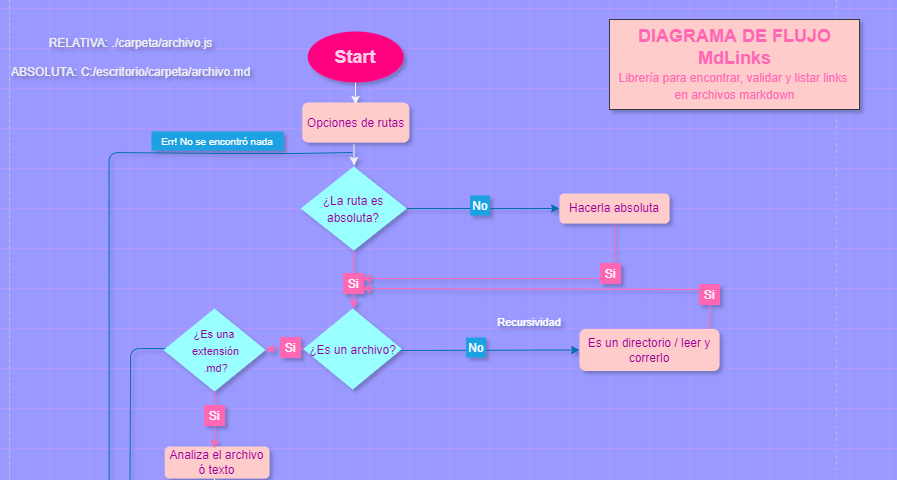
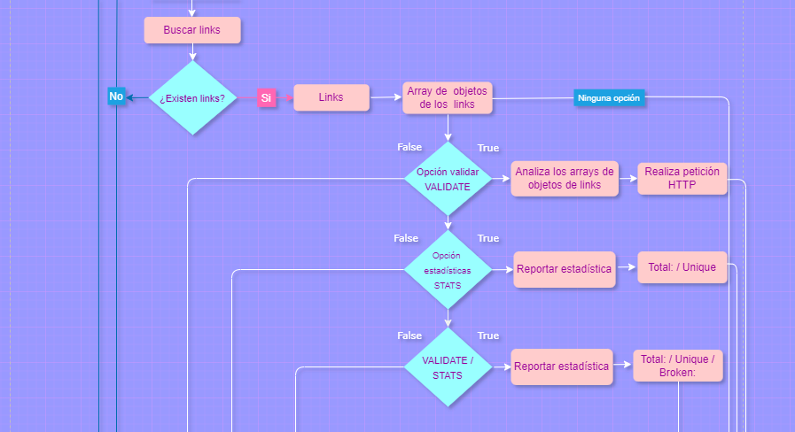

# Markdown Links
***
## Features
***
Markdown es un lenguaje de marcado ligero muy popular entre developers. Es usado en muchísimas plataformas que manejan texto plano (GitHub, foros, blogs, ...), y es muy común encontrar varios archivos en ese formato en cualquier tipo de repositorio (empezando por el tradicional README.md).

Estos archivos Markdown normalmente contienen links (vínculos/ligas) que muchas veces están rotos o ya no son válidos y eso perjudica mucho el valor de la información que se quiere compartir.

Dentro de una comunidad de código abierto, nos han propuesto crear una herramienta usando Node.js, que lea y analice archivos en formato Markdown, para verificar los links que contengan y reportar algunas estadísticas.

## Introduction
***
Node.js es un entorno de ejecución para JavaScript construido con el motor de JavaScript V8 de Chrome. Esto nos va a permitir ejecutar JavaScript en el entorno del sistema operativo, ya sea tu máquina o un servidor, lo cual nos abre las puertas para poder interactuar con el sistema en sí, archivos, redes, ...

En este proyecto nos alejamos un poco del navegador para construir un programa que se ejecute usando Node.js, donde aprenderemos sobre cómo interactuar con el sistema archivos, con el entorno (proceso, env, stdin/stdout/stderr), ...

## Objectives
***
El objetivo de esta librería es crear una herramienta que facilite a las personas a encontrar los links que hay dentro de un texto plano y verificar el status de estos, es decir, la librería verifica si los links estan rotos o son links funcionales y hace diferentes reportes con la información resumida.

## Flowchart

## Usability mode
***
La manera en que debe usarse es tecleando en la terminal primero el nombre del archivo o carpeta a analizar y despues alguno de los siguientes comandos:

mdlinks - Para obtener un reporte de los links que hay en el archivo o carpeta, asi como la ruta de cada uno de ellos
--validate - para obtener un reporte de los links, su status, es decir, si esta roto o no y la ruta absoluta del archivo donde se encuentra el link
-- stats - con este comado se encontrará una estadística de los links totales y los links únicos.
-stats -validate - con este comando la librería arroja una estadística de los totales, los únicos y los links que están rotos.
Esta librería utiliza la recursividad, por lo que si la ruta que se le agregó es carpeta, analiza todos los archivos con extetnsióm .md que haya dentro de la misma y si es carpeta, busca dentro de la misma, hasta desglosarse en puros archivos .md

Se le agregó un poco de color para hacerlo mas amigable para el usuario.

