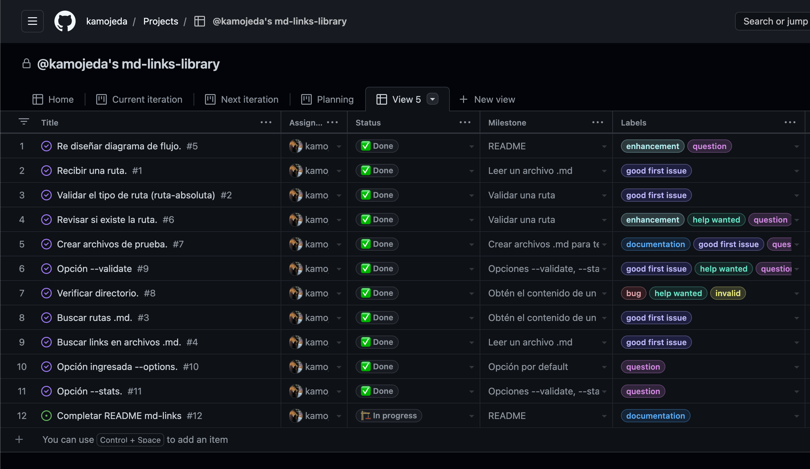
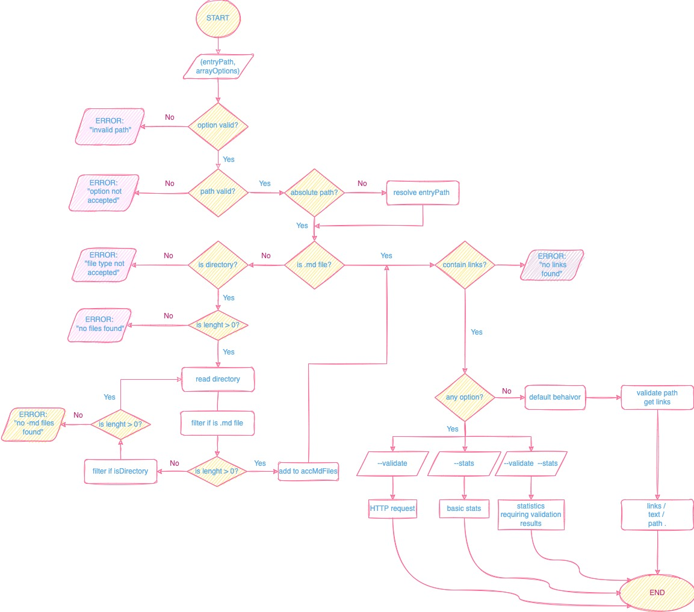

# **kmo-mdlinks** 🔗

## Índice

 [1. Descripción del proyecto](#1-descripción-del-proyecto)

 [2. Instalación | Uso](#2-instalación-Uso)
 
 [3. Consideraciones generales](#3-consideraciones-generales)

***

# **1. Descripción del proyecto**
Esta librería lee y analiza archivos en formato Markdown, para verificar el estado de los links que contengan y reportar algunas estadísticas. Se desarrolló usando Node.js.

# **2. Instalación | Uso**
## ***- Instalación***
 A través de la **terminal**:

Una vez inicializado tu proyecto [npm init]("https://docs.npmjs.com/cli/v9/commands/npm-init"),

desde tu terminal ejecuta:

`npm install kmo-mdlinks`
 
 ó

 `npm install https://github.com/kamojeda/DEV002-md-links.git`

## ***- Uso***
Debe poder ejecutarse a través de la **terminal**:

```
node ./bin/cli.js <path-to-file> [options]
```

`<path-to-file>` puede ser una ruta absoluta o relativa, el módulo podrá resolverla en ambos casos.

Se le puede indicar directamente `un archivo md o una carpeta.` 

Si la ruta es `una carpeta`, el módulo buscará los archivos markdown y los analizará según la opción ingresada.

`[options]`

**--validate**
Arrojará una lista con los links, su status y si es valido o no.

**--stats** Esta opción arroja las estadísticas básicas de los links.

**--validate --stats** Permitirá ejecutar ambas opciones.

**El comportamiento por defecto** no valida si las URLs responden "OK" o no, solo identifica el archivo markdown (a partir de la ruta que recibe como argumento), analiza el archivo Markdown e imprime los links que vaya encontrando, junto con la ruta del archivo donde aparece y el texto que hay dentro del link (truncado a 50 caracteres).

Por ejemplo:

```
node cli.js md_files/nodo_1/resumen.md 
```
```sh
---------------------------------------------------------------------------
  THE SOLVED PATH: /Users/osequeiros/Documents/Kamila/Proyectos-Laboratoria/DEV002-md-links/md_files/nodo_1/resumen.md
---------------------------------------------------------------------------

--------------------contains the following information --------------------

[
  {
    href: 'https://nodejs.org/es/',
    text: 'Node.js',
    entryMdFile: '/Users/osequeiros/Documents/Kamila/Proyectos-Laboratoria/DEV002-md-links/md_files/nodo_1/resumen.md'
  },
  {
    href: 'https://developers.google.com/v8/',
    text: 'motor de JavaScript V8 de Chrome',
    entryMdFile: '/Users/osequeiros/Documents/Kamila/Proyectos-Laboratoria/DEV002-md-links/md_files/nodo_1/resumen.md'
  }
]
```
```sh
node cli.js md_files/nodo_1/hoja_1/preambulo.md --validate
```
```sh
--------------------------------------------------------------------
  THE SOLVED PATH: /Users/osequeiros/Documents/Kamila/Proyectos-Laboratoria/DEV002-md-links/md_files/nodo_1/hoja_1/preambulo.md
--------------------------------------------------------------------
-------- contains the following information --------
[
  {
    href: 'https://es.wikipedia.org/wiki/Markdown',
    text: 'Markdown',
    file: '/Users/osequeiros/Documents/Kamila/Proyectos-Laboratoria/DEV002-md-links/md_files/nodo_1/hoja_1/preambulo.md',
    status: 200,
    message: 'Ok'
  },
  {
    href: 'https://nodejs.org/',
    text: 'Node.js',
    file: '/Users/osequeiros/Documents/Kamila/Proyectos-Laboratoria/DEV002-md-links/md_files/nodo_1/hoja_1/preambulo.md',
    status: 200,
    message: 'Ok'
  },
  {
    href: 'https://user-images.githubusercontent.com/110297/42118443-b7a5f1f0-7bc8-11e8-96ad-9cc5593715a6.jpg',
    text: 'md-links',
    file: '/Users/osequeiros/Documents/Kamila/Proyectos-Laboratoria/DEV002-md-links/md_files/nodo_1/hoja_1/preambulo.md',
    status: 200,
    message: 'Ok'
  }
]
```
```sh
node cli.js md_files/nodo_1/hoja_1/preambulo.md --stats --validate
```
```sh
---------------------------------------------------------------------------
  THE SOLVED PATH: /Users/osequeiros/Documents/Kamila/Proyectos-Laboratoria/DEV002-md-links/md_files/nodo_1/hoja_1/preambulo.md
---------------------------------------------------------------------------
-------------------- contains the following information --------------------
Total links: 3
Unique: 3
Broken: 0
```
```sh
node cli.js md_files/nodo_1/hoja_1/preambulo.md --stats
```
```sh
---------------------------------------------------------------------------
  THE SOLVED PATH: /Users/osequeiros/Documents/Kamila/Proyectos-Laboratoria/DEV002-md-links/md_files/nodo_1/hoja_1/preambulo.md
---------------------------------------------------------------------------
-------------------- contains the following information --------------------
Total links: 3
Unique: 3
```
----------
También puedes importar con `require` para usarlo
  programáticamente **en tu código**:

`const mdLinks = require("kmo-mdlinks")`

Ofrece la siguiente interfaz:
#### `mdLinks(path, options)`

### - Argumentos

* `path`: Ruta **absoluta** o **relativa** al **archivo** o **directorio**.
Si la ruta pasada es relativa, se resuelve como relativa al directorio
desde donde se invoca node - _current working directory_).
* `options`: Un objeto con **únicamente** la siguiente propiedad:
  - `validate`: Booleano que determina si se desea validar los links
    encontrados.

### - Valor de retorno

La función debe **retorna una promesa** (`Promise`) que **resuelve a un arreglo**
(`Array`) de objetos (`Object`), donde cada objeto representa un link y contiene
las siguientes propiedades

Con `validate:false` :

* `href`: URL encontrada.
* `text`: Texto que aparecía dentro del link (`<a>`).
* `file`: Ruta del archivo donde se encontró el link.

Con `validate:true` :

* `href`: URL encontrada.
* `text`: Texto que aparecía dentro del link (`<a>`).
* `file`: Ruta del archivo donde se encontró el link.
* `status`: Código de respuesta HTTP.
* `ok`: Mensaje `fail` en caso de fallo u `ok` en caso de éxito.

#### Ejemplo (resultados como comentarios)
```js
const mdLinks = require("kmo-mdlinks");

mdLinks("./some/example.md")
  .then(links => {
    // => [{ href, text, file }, ...]
  })
  .catch(console.error);

mdLinks("./some/example.md", { validate: true })
  .then(links => {
    // => [{ href, text, file, status, ok }, ...]
  })
  .catch(console.error);

mdLinks("./some/dir")
  .then(links => {
    // => [{ href, text, file }, ...]
  })
  .catch(console.error);
```

# **3. Consideraciones generales**
## ***- Organización y plan de acción***

📅 Trello, para organizar el sprint, es donde está el planning.

📅 Git-Hub Projects, para crear el plan de acción para priorizar y organizar el trabajo.



### - Diagrama de flujo



